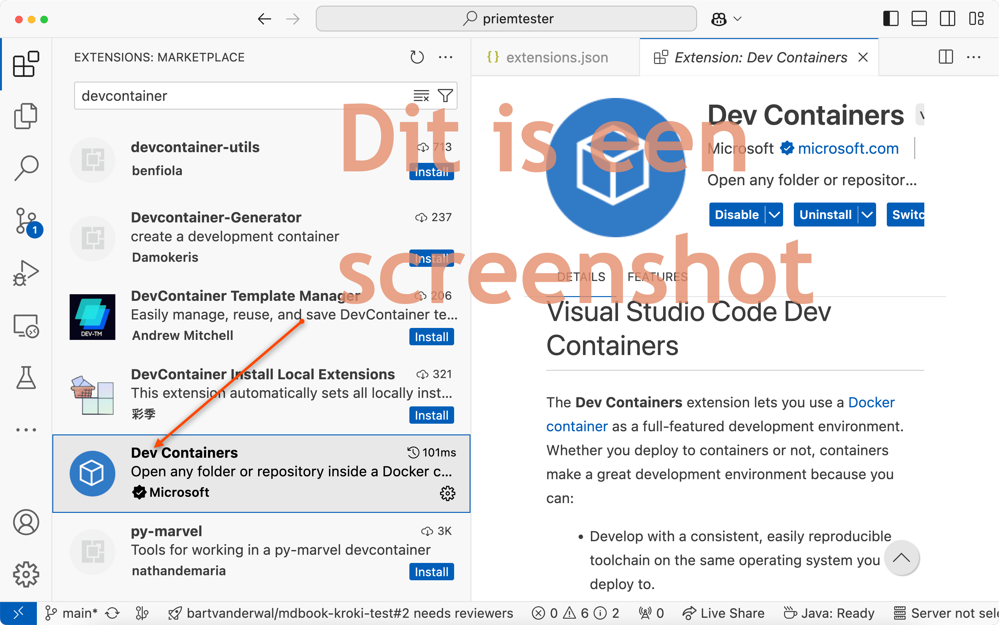

# Dev Container voor Java (Spring Boot), React (Vite) en met SQL Server database

Dev Containers werken in VS Code. In IntelliJ kun je een Docker RunTime Configuration instellen. Je kunt ook 'gewoon' `docker compose up` gebruiken, maar dan heb je geen 'hot reload'.

Je moet installeren:

- [WSL 2](https://docs.docker.com/desktop/features/wsl/]) (alleen op Windows; niet nodig op Linux of macOS)
- [Docker Desktop](https://www.docker.com/products/docker-desktop/)

